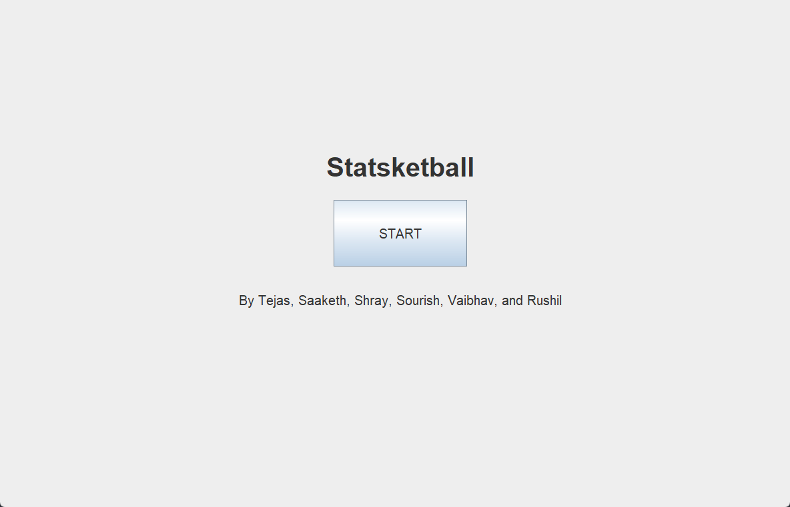
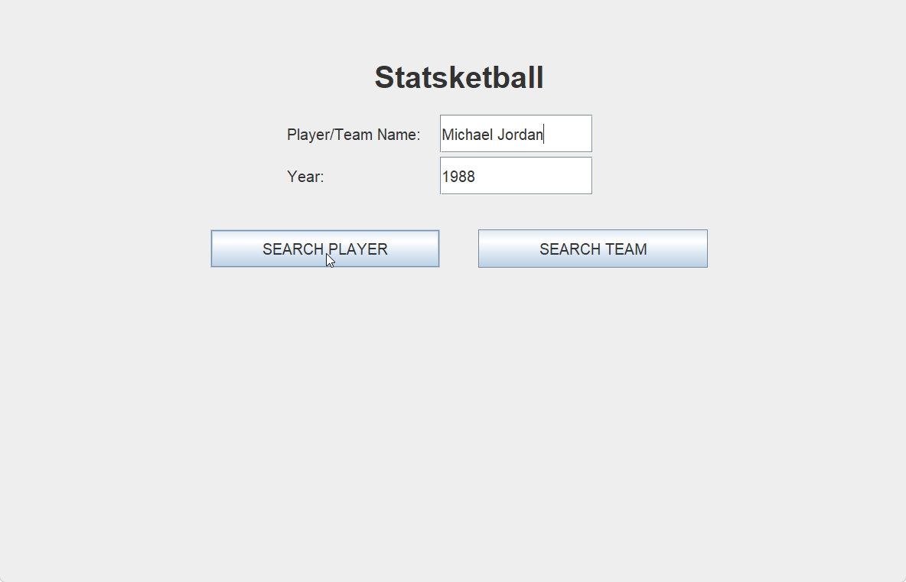
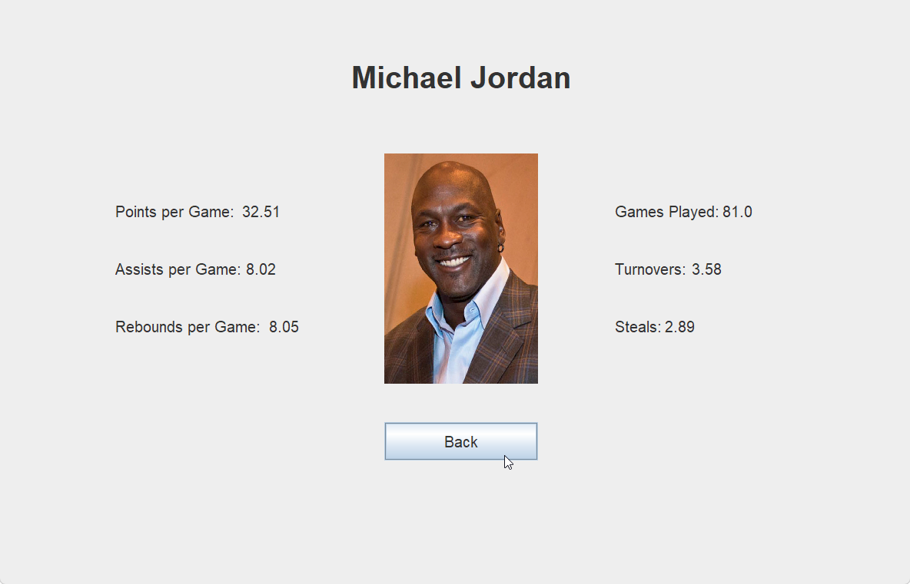

<!-- PROJECT SHIELDS -->

[![Contributors][contributors-shield]][contributors-url]
[![Stargazers][stars-shield]][stars-url]
[![Forks][forks-shield]][forks-url]
[![Commits][commits-shield]][commits-url]
[![Languages][languages-shield]][languages-url]
[![Creative Commons License][license-shield]][license-url]

<!-- ABOUT THE PROJECT -->

# Final Project for CSA

Basketball analysis thing that will hopefully look good and get us a good grade (thats all we can hope for)



<p align="right">(<a href="#top">back to top</a>)</p>

<!-- GETTING STARTED -->

## Getting Started

Here's how to compile + run the program - no prior Java knowledge needed

### Prerequisites

Install Java (follow Oracle's steps, they explain it better than I could)

- [Oracle's Instructions](https://www.java.com/en/download/help/windows_manual_download.html)

### Compilation/Running

1. Clone the repo

   ```sh
   git clone https://github.com/vsrivastava3939/csa-final-project.git
   ```

2. Unzip the repo file (the file named `csa-final-project-main.zip`)
3. Open your terminal and navigate to the code subfolder

   - Windows:

   ```sh
   cd %homepath%\Downloads\csa-final-project-main\code\
   ```

   - Mac/Linux:

   ```sh
   cd $HOME\Downloads\csa-final-project-main\code\
   ```

4. Compile the app

   ```sh
   javac src/*.java -d bin
   ```

5. Run the app

   ```sh
   java bin/ABAlytics
   ```

<p align="right">(<a href="#top">back to top</a>)</p>

<!-- USAGE EXAMPLES -->

## Usage

Here are some demo screenshots and videos

- 
- 
- 

<p align="right">(<a href="#top">back to top</a>)</p>

<!-- ROADMAP -->

## Roadmap

Our projected feature list (and devlog) is on our [Trello Board](https://trello.com/b/bHBmPCi3/project-dev-board)

[](https://trello.com/b/bHBmPCi3/project-dev-board)

<p align="right">(<a href="#top">back to top</a>)</p>

<!-- LICENSE -->

## License

Distributed under the Creative Commons License. See `LICENSE` for more information.

<p align="right">(<a href="#top">back to top</a>)</p>

<!-- MARKDOWN LINKS & IMAGES -->

[contributors-shield]: https://img.shields.io/github/contributors/vsrivastava3939/csa-final-project?logo=NBA&style=for-the-badge
[contributors-url]: https://github.com/vsrivastava3939/csa-final-project/graphs/contributors
[stars-shield]: https://img.shields.io/github/stars/vsrivastava3939/csa-final-project?logo=GitHub&style=for-the-badge
[stars-url]: https://github.com/vsrivastava3939/csa-final-project/stargazers
[forks-shield]: https://img.shields.io/github/forks/vsrivastava3939/csa-final-project?logo=Git&style=for-the-badge
[forks-url]: https://github.com/vsrivastava3939/csa-final-project/network/members
[commits-shield]: https://img.shields.io/github/commit-activity/w/vsrivastava3939/csa-final-project?logo=Git&style=for-the-badge
[commits-url]: https://github.com/vsrivastava3939/csa-final-project/commits
[license-shield]: https://img.shields.io/github/license/vsrivastava3939/csa-final-project?logo=Creative&20Commons&style=for-the-badge
[license-url]: https://github.com/vsrivastava3939/csa-final-project/blob/master/LICENSE.md
[languages-shield]: https://img.shields.io/github/languages/top/vsrivastava3939/csa-final-project?logo=Java&style=for-the-badge
[languages-url]: https://www.java.com/en/
