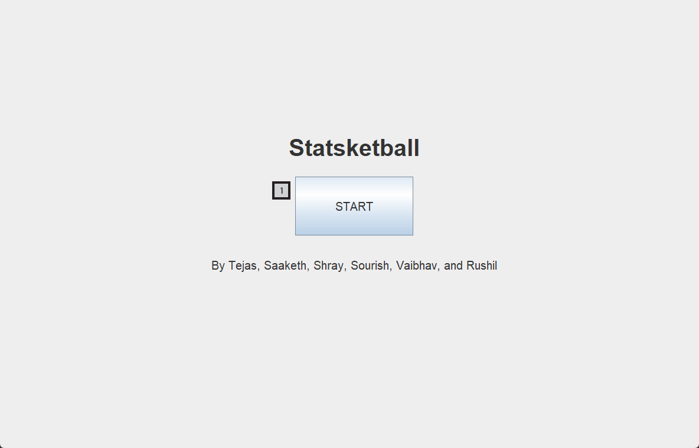
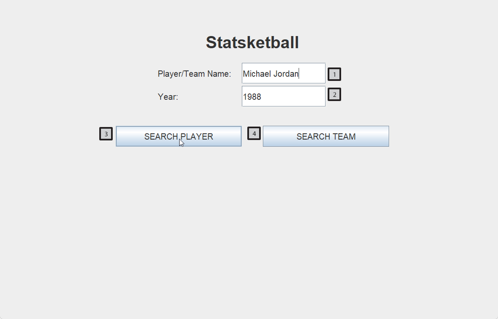
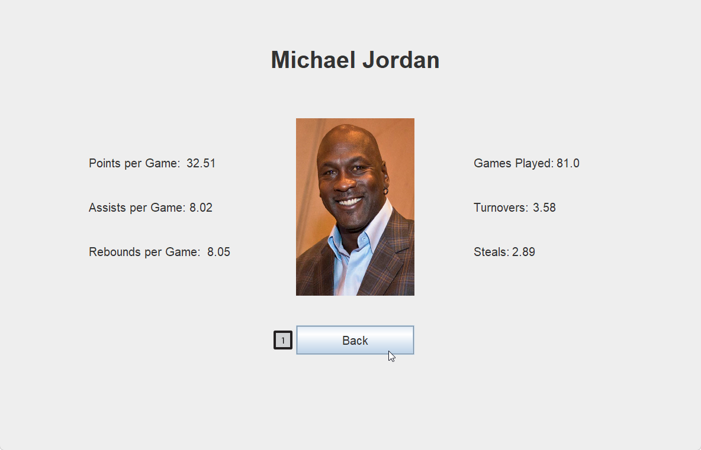

---
title: "Statsketball User Manual"
author: [Vaibhav Srivastava]
date: \today
subject: "Markdown"
keywords: [Markdown, Example]
lang: "en"
titlepage: true
titlepage-rule-height: 0
titlepage-background: "background3.pdf"
...

<!--- use `pandoc example.md -o example.pdf --from markdown --template eisvogel --listings` to export --->

# Statsketball

Statsketball is an interface for learning about NBA teams and players. The app consists of 3 screens, which the user can navigate through at will. The user inputs a certain NBA player or team. Using the input, the program fetches the stats for that NBA player or team and displays those stats on the interface, along with a picture of the player or team. Our application pulls statistics from an online basketball API.

## Title Screen

Screen 1 is merely the title screen, consisting of the title "Statsketball", followed by the names of its creators, Tejas, Saaketh, Shray, Sourish, Vaibhav, and Rushil.
There is also a button labelled "Start" (_Figure 1-1_) which, upon being pressed, moves the user to screen 2.

_Figure 1_

## Input Screen

Screen 2 is the user-input screen, consisting of two input fields (_Figure 2-1 and 2-2_) and two buttons (_Figure 2-3 and 2-4_). The user inputs the name of a player or team in the NBA into the top input field (_2-1_). The user then inputs the year for which the statistics should be retrieved into the bottom input field (_2-2_). The user then clicks the button that corresponds to their choice of input ("Player Search" (_2-3_) or "Team Search" (_2-4_)). **Make sure to input both a name and a year, or the app will not work.**

_Figure 2_

## Output Screen

Depending on the user's input, the output screen will display either a player's statistics or a team's statistics. There is a button at the bottom of the screen (_Figure 3-1_) to return to the user input screen.

_Figure 3_
